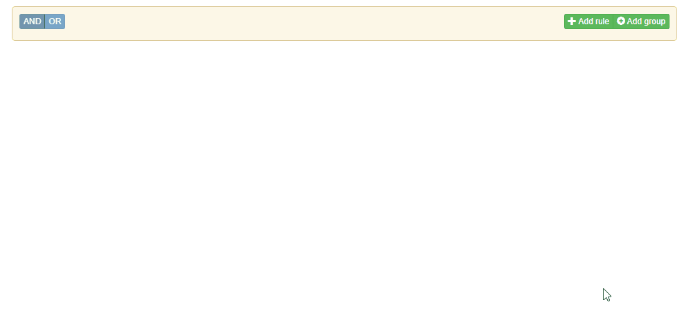
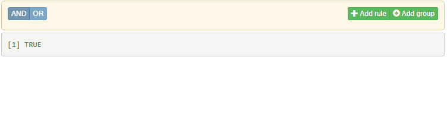
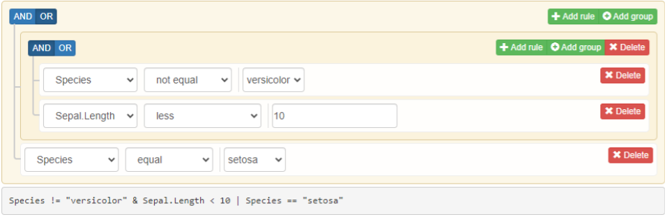

# shinyQueryBuilder

[](https://r-world-devs.github.io/shinyQueryBuilder/)
[](https://lifecycle.r-lib.org/articles/stages.html#experimental)

## Overview

`shinyQueryBuilder` provides an input widget that allows to construct
complex filtering queries in Shiny. It’s a wrapper for JS library
[jQuery-QueryBuilder](https://querybuilder.js.org/).



**Note:** The component assumes usage of Bootstrap \>= 5.0. For this
goal we recommend to use it with
 built dashboards.

### Usage

#### Filters

Filters are responsible for defining available options for providing
field-rules in the interface. With filters you may decide what operators
should be available for the field, what possible operator-values can be
chosen or even customize what kind of input controllers should be used
for that goal.

Filter configuration is performed with `queryFilter()` function:

``` r
filters <- list(
  queryFilter(
    id = "Species",                                    # filter id
    field = "Species",                                 # variable name
    label = "Species",                                 # filter label
    type = "character",                                # type/class of variable
    input = "select",                                  # input widget type
    values = c("versicolor", "virginica", "setosa"),   # possible filter values
    operators = c("equal", "not_equal")                # attached filter operators
  ),
  queryFilter(
    id = "Sepal.Length",
    field = "Sepal.Length",
    label = "Sepal.Length",
    type = "numeric",
    input = "number",
    operators = c("less", "less_or_equal", "greater", "greater_or_equal")
  )
)
```

In order to render the widget, pass the defined filters to
`queryBuilderInput()` and place the output to the Shiny’s UI object:

``` r
library(shiny)
library(bslib)
library(shinyQueryBuilder)

ui <- page_fluid(
  queryBuilderInput(
    "qb", 
    filters = filters
  ),
  shiny::verbatimTextOutput("expr")
)

server <- function(input, output, session) {
  output$expr <- renderPrint({
    print(queryBuilder::queryToExpr(input$qb))
  })
}

shinyApp(ui, server, options = list(launch.browser = TRUE))
```



The returned `input` object is a nested list that defines the provided
query. It can be easily converted to valid R filtering query using
[queryBuilder](https://github.com/r-world-devs/queryBuilder)
(`queryBuilder::queryToExpr`) - non-shiny package supporting
construction of complex filtering queries.

If you want to apply the filtering expression to your data, provide it
to `dplyr::filter` with `!!` operator, e.g.:

``` r
renderTable({
  dplyr::filter(iris, !!queryBuilder::queryToExpr(input$qb))
})
```

### Initialize `queryBuilderInput` state with `queryRule`(s)

As shown above, the returned widgets value is interpreted by
[queryBuilder](https://github.com/r-world-devs/queryBuilder) package.
The package itself allows to construct filtering query with the usage of
**rules** and **groups** - definitions for single field filtering
operation and the way for combining them into a single filtering query.

The following state:



is configured by `queryBuilder` with:

``` r
library(queryBuilder)
query_def <- queryGroup(
  condition = "OR",
  queryGroup(
    condition = "AND",
    queryRule("Species", "not_equal", "versicolor"),
    queryRule("Sepal.Length", "less", 10)
  ),
  queryRule("Species", "equal", "setosa")
)
queryToExpr(query_def)
#> Species != "versicolor" & Sepal.Length < 10 | Species == "setosa"
```

In order to initialize `queryBuilderInput` with the above state, simply
pass such query to `rules` argument:

``` r
library(shiny)
library(bslib)
library(shinyQueryBuilder)

ui <- page_fluid(
  queryBuilderInput(
    "qb", 
    filters = filters,
    rules = query_def
  ),
  shiny::verbatimTextOutput("expr")
)

server <- function(input, output, session) {
  output$expr <- renderPrint({
    print(queryBuilder::queryToExpr(input$qb))
  })
}

shinyApp(ui, server, options = list(launch.browser = TRUE))
```

The initiated state can be then customized by user when needed.


See more examples at
[examples](https://github.com/r-world-devs/shinyQueryBuilder/tree/master/examples).

## Installation

``` r
# CRAN version
install.packages("shinyQueryBuilder")

# Latest development version
remotes::install_github("https://github.com/r-world-devs/shinyQueryBuilder")
```

## Acknowledgement

Special thanks to [Kamil Wais](mailto:kamil.wais@gmail.com), [Adam
Foryś](mailto:adam.forys@gmail.com), [Maciej
Banaś](mailto:banasmaciek@gmail.com),[Karolina
Marcinkowska](mailto:karolina_marcinkowska@onet.pl) and [Kamil
Koziej](mailto:koziej.k@gmail.com) for the support in the package
development and thorough testing of its functionality.

## Getting help

In a case you found any bugs, have feature request or general question
please file an issue at the package
[Github](https://github.com/r-world-devs/shinyQueryBuilder/issues). You
may also contact the package author directly via email at
<krystian8207@gmail.com>.
