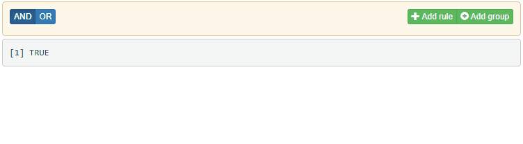

```{r, include = FALSE}
knitr::opts_chunk$set(
  collapse = TRUE,
  comment = "#>"
)
```

```{r setup}
library(shinyQueryBuilder)
```

Before the value is sent to Shiny server, rules provided by user are validated.
Invalid configuration for the associated rule (e.g. between operator value exceeding valid bounds) is highlighted
in the widget, what's more the value is not sent to the application server.


Validation can be customized on filter level with `validate` argument, defines as a list of the following arguments:

- `format` - character value defining how input should be formatted.
  - For 'Date' and 'POSIXct' filter types should be a [MomentJS](https://momentjs.com/docs/#/parsing/string-format/) format.
  - For 'character'-type filters regular expression.

```{r, eval = FALSE}
queryFilter(
  "BirthDate", type = "Date", validation = list(format = "YYYY-MM-DD")
)
queryFilter(
  "Name", type = "character", input = "text", validation = list(format = "[A-Z][a-z]+")
)
```


- `min`, `max` - minimum/maximum accepted value (for integer/numeric filters) or minimum/maximum character length (for character ones),
- `step` - provided value precision (for integer/numeric filters). Accept only values that are multiplication of `step`.

```{r, eval = FALSE}
queryFilter(
  "digit", type = "integer", validation = list(min = 0, max = 9, step = 1)
)
queryFilter(
  "weekday_abbr", type = "character", input = "textarea", validation = list(min = 3, max = 3)
)
```



- `allow_empty_value` - `TRUE/FALSE` should empty user inputs for this filter allowed?

- `messages` - message to be send to the user when input is not validated.
  Should be a list with keys being any of the above arguments. When the specific argument causes validation error, the corresponding message will be sent.

```{r, eval = FALSE}
queryFilter(
  "digit", type = "numeric",
  validation = list(
    min = 0, max = 9, step = 1,
    messages = list(
      min = "Minimum value allowed is 0",
      max = "Maximum value allowed is 9",
      step = "Only integers accepted"
    )
  )
)
queryFilter(
  "Name", type = "character", input = "text",
  validation = list(format = "[A-Z][a-z]+", messages = list(format = "Name should be capitalized"))
)
```

- `callback` - (advanced) JS function of used to perform the validation. If provided, the default validation will not be performed.
It must return `true` if the value is valid or an error string otherwise. The function should take two arguments:
    - `value` - the provided operator value,
    - `rule` the [Rule](https://querybuilder.js.org/#inside_the_box) object.

In order to define it, create the function definition as character string and pass it to `js` function:

```{r, eval = FALSE}
queryFilter(
  "fav_letter",
  type = "character",
  input = "text",
  validation = list(
    callback = js(paste0(
      "function(value, Rule) {",
      "var result = true;",
      "is_valid = value.length == 1 && value.toUpperCase() == value;",
      "if (!is_valid) {result = 'Single capital letter allowed only'};",
      "return result;",
      "}",
      collapse = ""
    ))
  )
)
```

Check the below application to test validation cases:

```{r, eval = FALSE}
library(shiny)
pkgload::load_all()

ui <- fluidPage(
  queryBuilderInput(
    "qb",
    filters = list(
      queryFilter(
        "BirthDate", type = "Date", validation = list(format = "YYYY-MM-DD")
      ),
      queryFilter(
        "digit", type = "numeric",
        validation = list(
          min = 0, max = 9, step = 1,
          messages = list(
            min = "Minimum value allowed is 0",
            max = "Maximum value allowed is 9",
            step = "Only integers accepted"
          )
        )
      ),
      queryFilter(
        "Name", type = "character", input = "text",
        validation = list(format = "[A-Z][a-z]+", messages = list(format = "Name should be capitalized"))
      ),
      queryFilter(
        "weekday_abbr", type = "character", input = "textarea", validation = list(min = 3, max = 3)
      ),
      queryFilter(
        "fav_letter",
        type = "character",
        input = "text",
        validation = list(
          callback = js(paste0(
            "function(value, Rule) {",
            "var result = true;",
            "is_valid = value.length == 1 && value.toUpperCase() == value;",
            "if (!is_valid) {result = 'Single capital letter allowed only'};",
            "return result;",
            "}",
            collapse = ""
          ))
        )
      )
    )
  ),
  shiny::verbatimTextOutput("expr")
)

server <- function(input, output, session) {
  output$expr <- renderPrint({
    print(queryToExpr(input$qb))
  })
}

shinyApp(ui, server, options = list(launch.browser = TRUE))
```
